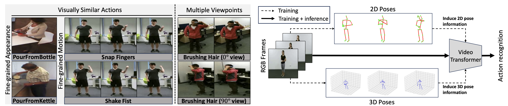

# Just Add $\pi$! Pose Induced Video Transformers for Understanding Activities of Daily Living


This is the official code for the CVPR 2024 paper titled "Just Add $\pi$! Pose Induced Video Transformers for Understanding Activities of Daily Living" [[arxiv]](https://arxiv.org/abs/2311.18840)

[](https://paperswithcode.com/sota/action-classification-on-toyota-smarthome?p=just-add-p-pose-induced-video-transformers) [](https://paperswithcode.com/sota/action-recognition-in-videos-on-ntu-rgbd?p=just-add-p-pose-induced-video-transformers) [](https://paperswithcode.com/sota/action-recognition-in-videos-on-ntu-rgbd-120?p=just-add-p-pose-induced-video-transformers)

## Installation
First, create a conda environment and activate it:
```
conda create -n pivit python=3.7 -y
source activate pivit
```

Then, install the following packages:
- torch & torchvision `pip install torch===1.8.1+cu111 torchvision===0.9.1+cu111 -f https://download.pytorch.org/whl/torch_stable.html`
- [fvcore](https://github.com/facebookresearch/fvcore/): `pip install 'git+https://github.com/facebookresearch/fvcore'`
- PyAV: `conda install av -c conda-forge`
- misc: `pip install simplejson einops timm psutil scikit-learn opencv-python tensorboard`

Lastly, build the codebase by running:
```
git clone https://github.com/dominickrei/pi-vit
cd pi-vit
python setup.py build develop
```

## Data preparation
We make use of the following action recognition datasets for evaluation: [Toyota Smarthome](https://project.inria.fr/toyotasmarthome/), [NTU RGB+D](https://rose1.ntu.edu.sg/dataset/actionRecognition/), and [NTU RGB+D 120](https://rose1.ntu.edu.sg/dataset/actionRecognition/). Download the datasets from their respective sources and structure their directories in the following formats.

### Smarthome
```
├── Smarthome
    ├── mp4
        ├── Cook.Cleandishes_p02_r00_v02_c03.mp4
        ├── Cook.Cleandishes_p02_r00_v14_c03.mp4
        ├── ...
    ├── skeletonv12
        ├── Cook.Cleandishes_p02_r00_v02_c03_pose3d.json
        ├── Cook.Cleandishes_p02_r00_v14_c03_pose3d.json
        ├── ...
```

### NTU RGB+D
```
├── NTU
    ├── rgb
        ├── S001C001P001R001A001_rgb.avi
        ├── S001C001P001R001A001_rgb.avi
        ├── ...
    ├── skeletons
        ├── S001C001P001R001A001.skeleton.npy
        ├── S001C001P001R001A001.skeleton.npy
        ├── ...
```
* By default, the NTU skeletons are in MATLAB format. We convert them into Numpy format using code provided in https://github.com/shahroudy/NTURGB-D/tree/master/Python

### Preparing CSVs
After downloading and preparing the datasets, prepare the CSVs for training, testing, and validation splits as `train.csv`, `test.csv`, and `val.csv`. The format of each CSV is:
```
path_to_video_1,path_to_video_1_skeleton,label_1
path_to_video_2,path_to_video_2_skeleton,label_2
...
path_to_video_N,path_to_video_N_skeleton,label_N
```

## Usage
We provide configs for training $\pi$-ViT on Smarthome and NTU in [configs/](configs/). Please update the paths in the config to match the paths in your machine before using.

### Training
Download the necessary pretrained models (Kinetics-400 for Smarthome and SSv2 for NTU) from [this link](https://github.com/facebookresearch/TimeSformer?tab=readme-ov-file#model-zoo) and update `TRAIN.CHECKPOINT_FILE_PATH` to point to the downloaded model.

For example to train $\pi$-ViT on Smarthome using 8 GPUs run the following command:

`python tools/run_net.py --cfg configs/Smarthome/PIViT_Smarthome.yaml NUM_GPUS 8`

### Testing
| Model | Dataset | mCA | Top-1 | Download (soon) |
| --- | --- | --- | --- | --- |
$\pi$-ViT | Smarthome CS | 72.9 | - | [link]() |
$\pi$-ViT | Smarthome CV1 | 55.2 | - | [link]() |
$\pi$-ViT | Smarthome CV2 | 64.8 | - | [link]() |
$\pi$-ViT | NTU-60 CS | - | 91.9 | [link]() |
$\pi$-ViT | NTU-60 CV | - | 92.9 | [link]() |
$\pi$-ViT | NTU-120 CS | - | 94.0 | [link]() |
$\pi$-ViT | NTU-120 CSet | - | 97.9 | [link]() |

After downloading a pretrained model, evaluate it using the command:

`python tools/run_net.py --cfg configs/Smarthome/PIViT_Smarthome.yaml NUM_GPUS 8 TEST.CHECKPOINT_FILE_PATH /path/to/downloaded/model TRAIN.ENABLE False`

## Citation & Acknowledgement
```
@article{reilly2024pivit,
    title={Just Add $\pi$! Pose Induced Video Transformers for Understanding Activities of Daily Living},
    author={Dominick Reilly and Srijan Das},
    booktitle={Proceedings of the Conference on Computer Vision and Pattern Recognition (CVPR)}
    year={2024}
}
```
Our primary contributions can be found in:
- [train_net.py](tools/train_net.py), [pivit.py](timesformer/models/pivit.py), [pivit_modules.py](timesformer/models/pivit_modules.py), [losses.py](timesformer/models/losses.py), [smarthome.py](timesformer/datasets/smarthome.py), [ntu.py](timesformer/datasets/ntu.py)

This repository is built on top of [TimeSformer](https://github.com/facebookresearch/TimeSformer).
